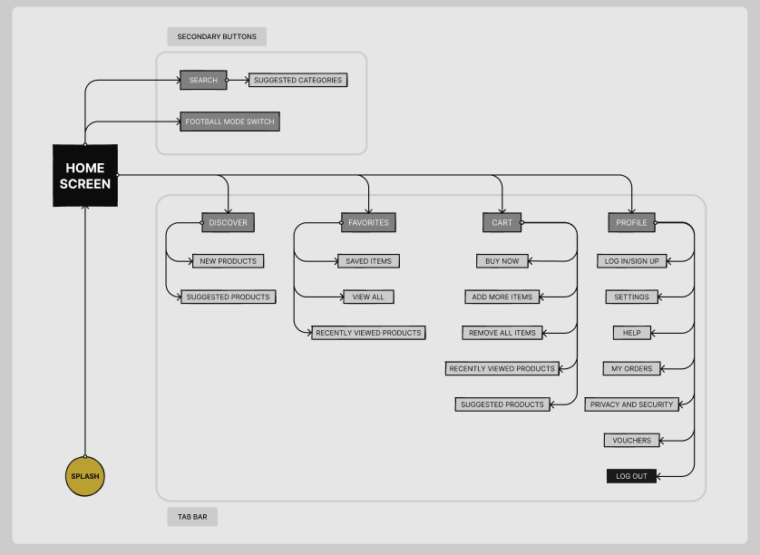

# Tifossi App Structure Documentation

## Overview

Tifossi is a mobile-first iOS e-commerce application built with React Native and Expo. This document outlines the structure of the application, its components, screens, and overall architecture to help developers understand the codebase organization.



## Project Structure

### Root Directory Structure

```
/
├── app/                # Main application code (Expo Router)
├── app-example/        # Example application code/templates
├── assets/             # Static assets (images, fonts, icons)
├── docs/               # Documentation files
├── hooks/              # Custom React hooks
│   ├── useProducts.ts  # Product data fetching hooks
│   ├── useSearch.ts    # Search functionality hook
│   └── useThemeColor.ts # Theme color selection
├── scripts/            # Project utility scripts
├── ios/                # iOS specific configuration
├── android/            # Android specific configuration
├── types/              # Global type definitions
├── __tests__/          # Test files and utilities
├── .husky/             # Git hooks configuration
├── .vscode/            # VSCode configuration
└── .cursor/            # Project guidelines and rules
```

### App Directory Structure (Expo Router)

```
app/
├── (tabs)/             # Tab-based navigation screens
│   ├── _layout.tsx     # Tab navigation layout
│   ├── index.tsx       # Home screen (store)
│   ├── cart.tsx        # Shopping cart screen
│   ├── favorites.tsx   # Favorite products screen
│   ├── profile.tsx     # User profile screen
│   └── tiffosiExplore.tsx # Explore screen
├── (home)/             # Home-specific screens
│   └── index.tsx       # Home entry point
├── checkout/           # Checkout process screens
│   ├── _layout.tsx     # Checkout layout
│   ├── shipping-address.tsx # Shipping address form
│   ├── payment-selection.tsx # Payment method selection
│   └── new-address.tsx # New address entry form
├── products/           # Product-related screens
│   ├── _layout.tsx     # Products layout
│   ├── product.tsx     # Product details screen
│   └── index.ts        # Product exports
├── _components/        # All React components
├── _services/          # Application services
│   ├── preload/        # Asset preloading system
│   │   ├── service.ts         # Preload service singleton
│   │   ├── assetLoader.ts     # Asset loading utilities
│   │   ├── dataLoader.ts      # Data loading utilities
│   │   ├── homeAssets.ts      # Home screen asset loader
│   │   └── types.ts           # Preload type definitions
│   └── api/            # API service and mock implementations
│       └── mockApi.ts  # Mock API for development
├── _stores/            # Global state stores
│   ├── cartStore.ts    # Shopping cart state management
│   ├── favoritesStore.ts # Favorites state management
│   └── authStore.ts    # Authentication state management
├── _types/             # TypeScript type definitions
├── _styles/            # Global styles and themes
├── _data/              # Mock data and content
├── not-found.tsx       # 404 error page
├── _layout.tsx         # Root layout component
└── index.tsx           # Entry point
```

### Components Directory Structure

```
_components/
├── ui/                 # Core UI components
│   ├── layout/         # Layout primitives
│   │   ├── Grid.tsx    # Grid system
│   │   └── Section.tsx # Section containers
│   ├── typography/     # Text components
│   │   └── Text.tsx    # Text component with variants
│   ├── buttons/        # Button variants
│   │   └── Button.tsx  # Button component
│   ├── cards/          # Generic card components
│   ├── badges/         # Badge components
│   │   └── DiscountBadge.tsx # Discount badge
│   ├── toggle/         # Toggle components
│   │   └── ToggleSport.tsx # Sport toggle
│   ├── form/           # Form components
│   │   ├── Counter.tsx      # Quantity counter
│   │   ├── Input.tsx        # Text input
│   │   ├── Dropdown.tsx     # Dropdown selector
│   │   ├── RadioButton.tsx  # Radio button
│   │   └── SingleChoice.tsx # Option selector
│   ├── icons/          # Icon components
│   │   ├── HeartActiveIcon.tsx # Active heart icon
│   │   └── index.ts      # Icon exports
│   ├── links/          # Link components
│   └── README.md       # UI component guidelines
├── store/              # Store-specific components
│   ├── product/        # Product card variants
│   │   ├── types.ts        # Product component types
│   │   ├── default/        # Default product cards
│   │   ├── featured/       # Featured product cards
│   │   ├── horizontal/     # Horizontal product cards
│   │   ├── promotion/      # Promotion product cards
│   │   ├── swipeable/      # Swipeable product details (performance optimized)
│   │   ├── gallery/        # Product gallery components
│   │   ├── overlay/        # Overlay components
│   │   │   ├── OverlayCheckoutQuantity.tsx
│   │   │   ├── OverlayCheckoutShipping.tsx
│   │   │   ├── OverlayProductEditSize.tsx
│   │   │   ├── OverlayShippingAddress.tsx
│   │   │   ├── OverlayShippingSelection.tsx
│   │   │   └── OverlayProductSearch.tsx # Product search overlay
│   │   ├── cart/           # Cart product cards
│   │   ├── details/        # Product details components
│   │   ├── header/         # Product header components
│   │   ├── lists/          # Product list components
│   │   ├── size/           # Size selector components
│   │   ├── support/        # Support components
│   │   └── index.tsx       # Product component exports
│   ├── layout/         # Store layout components
│   │   ├── Header.tsx       # Store header
│   │   ├── Footer.tsx       # Store footer
│   │   ├── Categories.tsx   # Category navigation
│   │   ├── Locations.tsx    # Store locations
│   │   ├── ProductHeader.tsx # Product detail header
│   │   └── index.tsx         # Layout exports
│   ├── cart/           # Cart components
│   │   └── EmptyCart.tsx    # Empty cart state
│   ├── favorites/      # Favorites components
│   │   └── EmptyFavorites.tsx # Empty favorites state
│   └── review/          # Product review components
│       └── ReviewCard.tsx   # Review component
├── home/               # Home screen components
│   ├── HomeContent.tsx # Home content
│   └── HomeHeader.tsx  # Home header
├── skeletons/          # Loading state components
│   └── HomeScreenSkeleton.tsx # Loading skeleton
├── common/             # Shared utility components
│   ├── ErrorBoundary.tsx   # Error handler
│   ├── Subheader.tsx        # Subheader component
│   ├── VideoBackground.tsx  # Video background
│   ├── animation/           # Animation components
│   │   └── AdvancedAnimation.tsx # Animation component
│   └── share/               # Sharing functionality
│       └── ShareButton.tsx  # Share button
├── navigation/         # Navigation components
│   ├── TabBar.tsx          # Bottom tab bar
│   ├── TabBarBackground.tsx # Tab bar background
│   └── category/           # Category navigation
│       └── CategoryNavigation.tsx # Category menu
└── splash/             # Splash screen components
    └── SplashScreen.tsx    # App splash screen
```

### Types Directory Structure

```
types/
├── index.ts           # Central type exports
├── ui.ts              # UI component types
├── navigation.ts      # Navigation types
├── product.ts         # Product interface and related types
├── product-status.ts  # Product status and label enums
├── product-card.ts    # Product card type system
└── declarations/svg.d.ts  # SVG type definitions (excluded from routing)
└── README.md          # Type system documentation
```

### Tests Directory Structure

```
__tests__/
├── setup.ts           # Test setup and configuration
├── smoke.test.tsx     # Basic smoke tests
└── components.test.tsx # Component tests
```

### Styles Directory Structure

```
styles/
├── colors.ts      # Color palette definitions
├── typography.ts  # Typography styles
├── spacing.ts     # Spacing and layout constants
├── shadows.ts     # Shadow styles
└── tokens/        # Design tokens
    └── featured.ts # Featured section tokens
```

## Navigation Structure

The app uses Expo Router with a tab-based navigation structure:

1. **Store Tab** - Main product browsing experience
2. **Favorites Tab** - Saved/favorite products
3. **Home Tab** - Landing/home page with featured content
4. **Cart Tab** - Shopping cart management
5. **Profile Tab** - User settings and information

## Component Categories

### UI Components
1. **Layout Components**
   - Grid system for responsive layouts
   - Section containers with consistent spacing
   - Flexible layout primitives

2. **Typography Components**
   - Text variants for different contexts
   - Heading styles with proper hierarchy
   - Styled text elements

3. **Form Components**
   - Input fields with validation
   - Selection controls for user choices
   - Form layout and organization

4. **Button Components**
   - Primary action buttons
   - Secondary/tertiary buttons
   - Icon buttons for compact actions

### Store Components
1. **Product Cards**
   - Default cards (small/large)
   - Featured cards for highlights
   - Horizontal cards for lists
   - Promotion cards for discounts
   - Cart cards for shopping experience

2. **Layout Components**
   - Store header with navigation
   - Category sections
   - Location displays
   - Footer with branding

3. **Review Components**
   - Rating display
   - Review cards with user info

### Common Components
1. **Utility Components**
   - Error boundaries for error handling
   - Video backgrounds
   - Animation utilities

2. **Navigation Components**
   - Tab bar with icons
   - Category navigation
   - Header navigation elements

## Type System

The app uses TypeScript with a well-structured type system. Key type categories include:

### Product Types
Product data structures and related types for consistent product representation:

```typescript
interface Product {
  id: string;
  title: string;
  price: number;
  image: string | ImageSourcePropType;
  label?: ProductLabel;
  status?: ProductStatus;
  description?: string | string[];
  discountedPrice?: number;
  isCustomizable?: boolean;
  colors?: {
    color: string;
    quantity: number;
  }[];
  size?: string;
  sizes?: ProductSize[];
}
```

### UI Component Types
Consistent prop types for UI components:

```typescript
interface BaseComponentProps {
  style?: StyleProp<ViewStyle>;
  testID?: string;
}

interface TextComponentProps {
  style?: StyleProp<TextStyle>;
  children?: React.ReactNode;
}
```

### Card Types
Type system for product cards:

```typescript
type CardVariant = 'default' | 'featured' | 'horizontal' | 'promotion' | 'minicard' | 'image-only';
type CardSize = 'small' | 'large';

interface CardDimensions {
  width: number | string;
  height: number;
  imageSize: number;
}
```

## Development Guidelines

### Debugging and Problem Solving
- **Always read this document first** before searching the codebase
- Refer to the component hierarchy for understanding relationships
- Check raw-components for visual reference when debugging UI issues
- Look at the imports to understand dependencies

### Mobile-First iOS Development
- Always design and implement with iOS as the primary platform
- Follow iOS-native interaction patterns
- Test on iOS devices/simulators first
- Consider iOS system features (safe area, notch, etc.)

### Visual Verification
- Always check that components match both JSX reference and screenshots
- Use the raw-components directory for visual guidance
- Verify spacing, typography, and colors match the Figma specs

### Code Organization Principles
- Modular component architecture
- Clear separation of concerns
- Consistent naming and file structure
- Type safety throughout the codebase

### Simplicity Over Complexity
- Prefer simple solutions when possible
- Avoid premature optimization
- Keep component logic focused
- Follow established patterns

## Implementation Status

✅ **Fully Implemented**
- Core UI Components
- Product Card System
- Navigation Structure
- Type System
- Store Layout
- Swipeable Interfaces (Performance Optimized)
- Advanced Animations
- Loading States
- Asset Preloading
- Progressive Loading System
- Local State Management (Cart, Favorites)

🟡 **Partially Implemented**
- Form Components
- Review System
- User Authentication
- Server State Integration
- Search Functionality (Initial client-side implementation)

## Additional Resources

- Check [components.md](./components.md) for detailed component specifications
- See [product_card.md](./product_card.md) for product card implementation details
- See [loading_system.md](./loading_system.md) for details on the preloading and progressive loading system
- See [state_management.md](./state_management.md) for overall state management strategy
- See [local_state_management.md](./local_state_management.md) for client-side state implementation details
- See [state_management_client_side.md](./state_management_client_side.md) for the full client-side state implementation plan

## Notes

- The `raw-components` directory mentioned in this document and README.md does not currently exist in the codebase, though it's referenced as a place for Figma reference components.